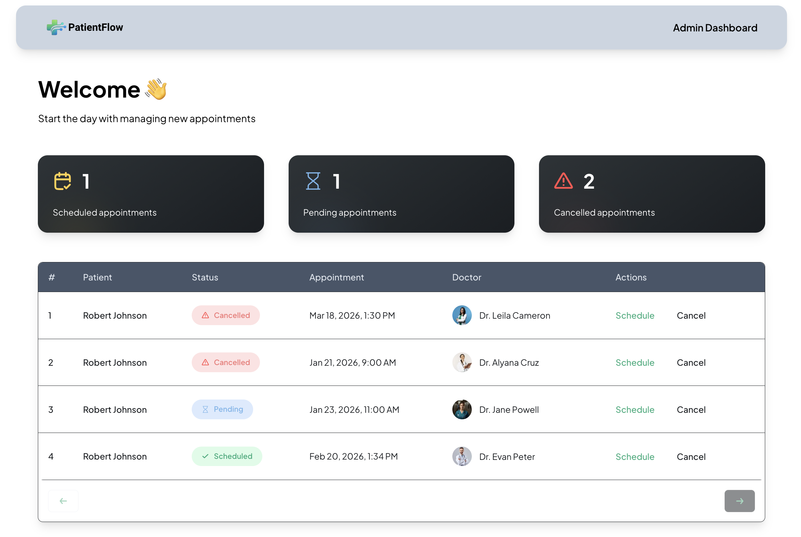
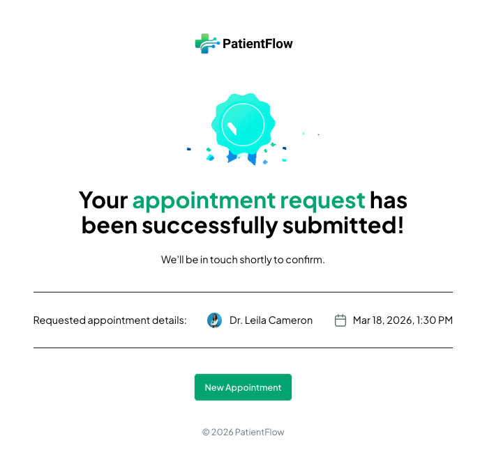
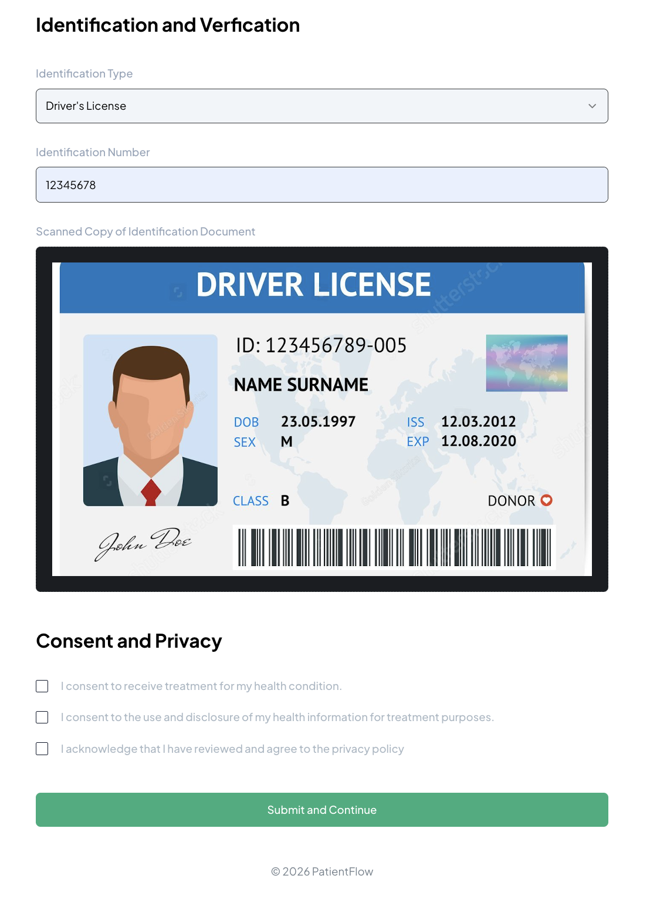
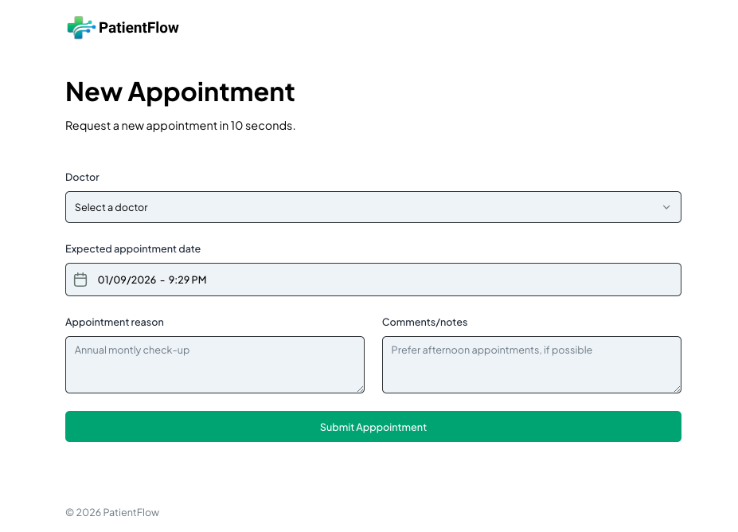

# 🏥 PatientFlow — Healthcare Patient Management System

PatientFlow is a full-stack healthcare patient management system that allows patients to register, book, and manage appointments, while administrators can schedule, confirm, and cancel visits. It also includes SMS notifications and secure file uploads, all built with a modern Next.js stack.

---

## 🚀 Tech Stack

- ⚛️ **Next.js (App Router)**
- 🧠 **TypeScript**
- 🎨 **Tailwind CSS**
- 🧩 **shadcn/ui**
- 🗄️ **Appwrite (Database + Storage + Auth)**
- 📩 **Twilio (SMS Notifications)**
- 🛡️ **Sentry (Monitoring & Performance Tracking)**

---

## 🔋 Features

👉 **Patient Registration** — Users can create personal patient profiles  
👉 **Book Appointments** — Schedule visits with available doctors  
👉 **Admin Dashboard** — View, manage, and control all appointments  
👉 **Confirm & Schedule Appointments** — Admins finalize visit times  
👉 **Cancel Appointments** — Admins can cancel when necessary  
👉 **SMS Notifications** — Patients receive confirmation texts via Twilio  
👉 **File Uploads** — Secure ID and document uploads using Appwrite Storage  
👉 **Fully Responsive UI** — Optimized for desktop, tablet, and mobile  
👉 **Performance Monitoring** — Sentry tracks errors and system health  
👉 **Scalable Architecture** — Modular, reusable components and services

---

## 🖼️ Screenshots

### 🧑‍⚕️ Admin Dashboard & Appointment Confirmation

| Admin Dashboard | Appointment Confirmation |
|----------------|---------------------------|
|  |  |

### 🏠 Home & Patient Identification

| Home Page | Identification Verification |
|---------|------------------------------|
|  |  |

### 📅 Booking New Appointment

| New Appointment Form |
|----------------------|
|  |

---

## ⚙️ Environment Variables

Create a file named `.env.local` in the root directory:

```env
# APPWRITE
NEXT_PUBLIC_ENDPOINT=https://cloud.appwrite.io/v1
PROJECT_ID=
API_KEY=
DATABASE_ID=
PATIENT_COLLECTION_ID=
APPOINTMENT_COLLECTION_ID=
NEXT_PUBLIC_BUCKET_ID=

# ADMIN ACCESS
NEXT_PUBLIC_ADMIN_PASSKEY=111111
```

🔐 **Never commit your `.env.local` file to version control.**

---

## 🤸 Quick Start

### ✅ Prerequisites

Make sure you have:

- Git
- Node.js (18+ recommended)
- npm

---

### 📦 Clone the Repository

```bash
git clone https://github.com/johnsonr84/healthcare-patient-management-system.git
cd healthcare-patient-management-system
```

---

### 📥 Install Dependencies

```bash
npm install
```

---

### ▶️ Run the Development Server

```bash
npm run dev
```

Open your browser and navigate to:

```
http://localhost:3000
```

---

## 🧠 System Architecture

### 🔄 Patient Flow

1. Patient registers and submits personal info  
2. Uploads ID for verification  
3. Requests appointment  
4. Admin reviews and confirms  
5. SMS confirmation sent via Twilio  
6. Appointment appears in dashboard history

---

## 🔐 Security & Compliance

- Secure Appwrite authentication
- Role-based admin access
- Secure file storage
- Encrypted API communication
- Consent & privacy acknowledgment built into flows

> ⚠️ This project is for educational/demo purposes and not HIPAA compliant out of the box.

---

## 🧪 Monitoring & Reliability

- Sentry tracks:
  - API failures
  - UI errors
  - Performance bottlenecks

---

## 📌 Repo Topics (Suggested)

```
nextjs
healthcare
appointment-booking
appwrite
twilio
patient-management
admin-dashboard
saas
typescript
tailwindcss
```

---

## 📄 License

MIT License — free to use for learning, demos, and portfolio projects.

---

## 👨‍💻 Author

**Robert Johnson**  
Full-Stack & AI Engineer  
GitHub: https://github.com/johnsonr84

---

